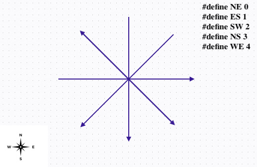

# Описание
Представлено решение задачи переключения светофоров на перекрёстке. Направления движения определяются сторонами света (NE, ES, SW, NS, WE). Для простоты задачи возьмём 2 сигнала светофора - зелёный и красный (с жёлтым задача становится сильно объёмнее, что несовсем оправдано для данного предмета). Очевидно, что сигланы светофора на пересекающихся дорогах не должны быть одновременно залёными, но и если все сигналы будут красными, то движение застопорится. В нашем примере будет 5 дорог, для наглядности давйте рассмотрим картинку:

Очевидно, что трафики SW и NE могут двигататься одновременно, так как не мешают друг другу, как, например, SW и WE.

# LTL-формулы
В коде направления движения обозначены в соответствии с п.1; сигналы светофора - _green_, _red_; у каждой дороги есть 3 состояния - _free_, _locked_, _unlocked_; также мы будем хранить массив запросов (requests), массив состояний световоров (lights) и массив, который описывает движение по направлениям (senses).

Таким образом можно свормировать следующие условия:
1) Обеспечивает отсутствие пересечений трафика:
```
[] (ns_safety && ne_safety && es_safety && sw_safety && we_safety)
```
2) Обеспечивает то, что трафик не будет стоять вечно
```
[] (
    ((senses[NS] && lights[NS] == red) -> <>(lights[NS] == green)) &&
    ((senses[NE] && lights[NE] == red) -> <>(lights[NE] == green)) &&
    ((senses[ES] && lights[ES] == red) -> <>(lights[ES] == green)) &&
    ((senses[SW] && lights[SW] == red) -> <>(lights[SW] == green)) &&
    ((senses[WE] && lights[WE] == red) -> <>(lights[WE] == green))
)
```
3) Обеспечивает корректность исполнения
```
[]((<>!(nsgreen && nssense)) && (<>!(negreen && nesense)) && (<>!(esgreen && essense)) && (<>!(swgreen && swsense)) && (<>!(wegreen && wesense)))

```


```
[]((<>!(lights[NS] == green && senses[NS])) && (<>!(lights[NE] == green && senses[NE])) && (<>!(lights[ES] == green && senses[ES])) && (<>!(lights[SW] == green && senses[SW])) && (<>!(lights[WE] == green && senses[WE])))
```
```
[]((<>!(lights[NS] == green && senses[NS])) && (<>!(lights[NE] == green && senses[NE])) && (<>!(lights[ES] == green && senses[ES])) && (<>!(lights[SW] == green && senses[SW])) && (<>!(lights[WE] == green && senses[WE])))
```
